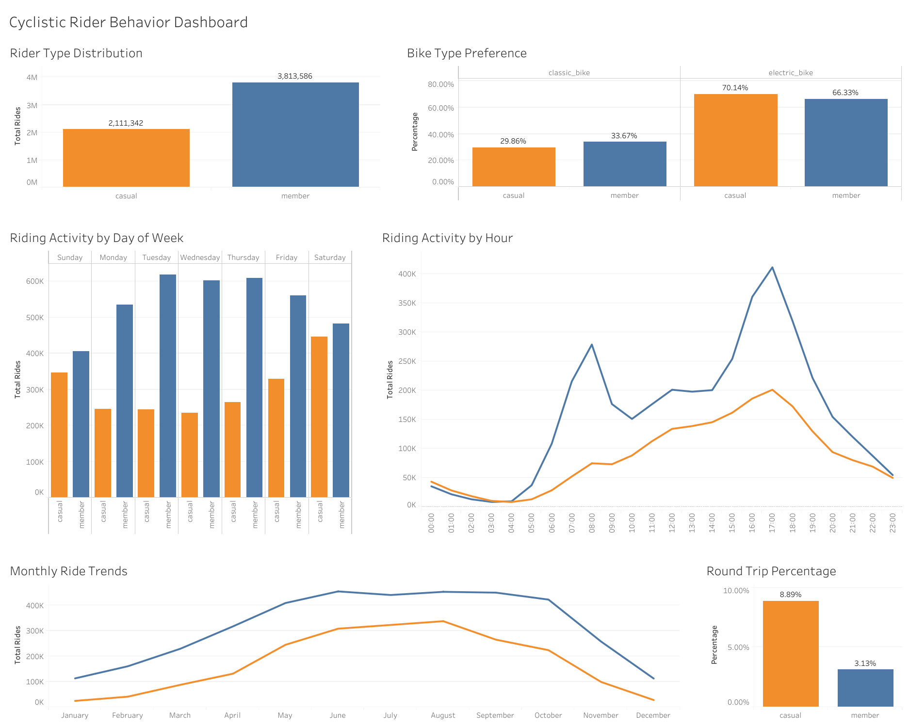
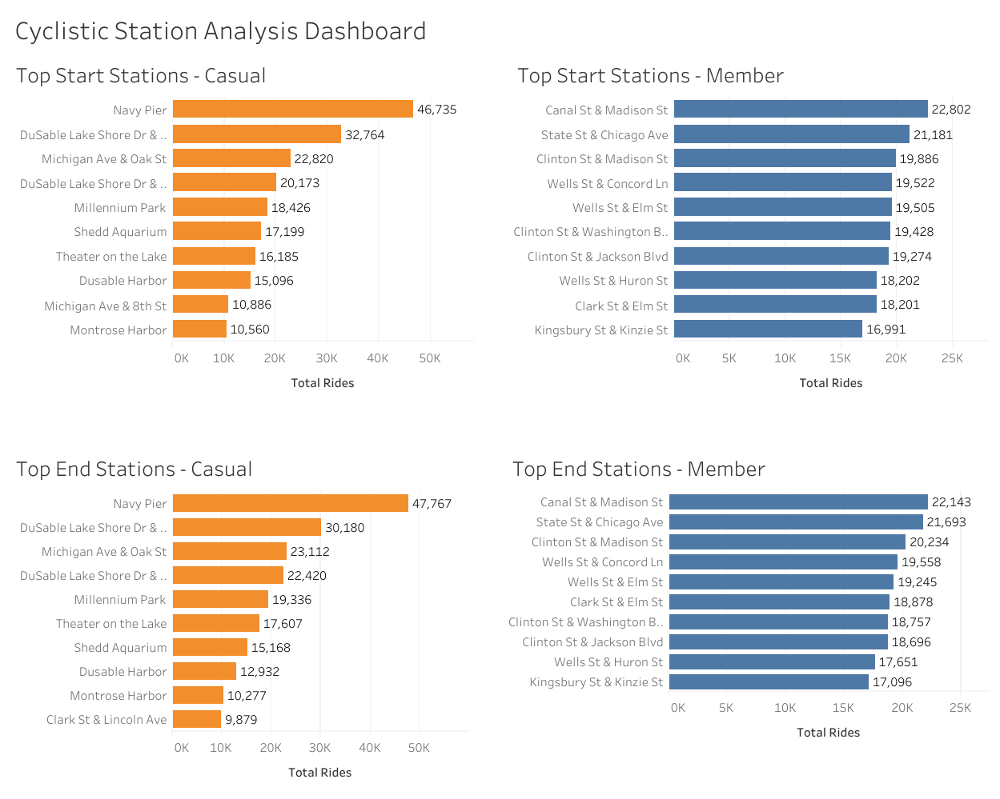

# 🚲 Cyclistic Bike-Share Analysis

## 📌 Project Overview

This project analyzes 12 months of Cyclistic bike-share trip data to identify the behavioral differences between annual members and casual riders.

The analysis was completed as part of the Google Data Analytics Professional Certificate Capstone Project.

Using SQL (Google BigQuery), over 5.9 million ride records were cleaned, transformed, and analyzed. The findings were then visualized using Tableau through interactive dashboards to support business recommendations.

📄 **[View Full Case Study (PDF)](documentation/Cyclistic_Bike_Share_Analysis_Final.pdf)**

---
---

## 🎯 Business Task

Cyclistic, a bike-share company based in Chicago, wants to increase the number of annual memberships.

The objective of this project is to analyze the differences between annual members and casual riders and identify behavioral patterns that can help the marketing team develop strategies to convert casual riders into annual members.
---

## 🛠️ Tools Used

- **SQL (Google BigQuery)** – Data cleaning, transformation and analysis
- **Tableau Public** – Data visualization and interactive dashboards
- **Google Sheets** – Initial data inspection
- **Visual Studio Code** – Project documentation (README)
- **GitHub** – Version control and portfolio presentation
---

## 📂 Dataset

The dataset contains 12 months of historical Cyclistic bike-share trip data provided by Divvy Bikes and made available by Google as part of the Google Data Analytics Capstone project.

- **Period:** 12 months
- **Total records analyzed:** 5,924,928 rides
- **Data source:** Divvy Bike Share / Google Data Analytics Capstone
- **Storage & Analysis:** Google BigQuery
---
## 📂 Project Structure

Cyclistic-Bike-Share-Analysis/
│
├── README.md
├── sql/
│   └── cyclistic_analysis.sql
├── tableau/
│   └── Cyclistic Bike Share Analysis.twbx
├── images/
└── documentation/
    ├── Cyclistic_Bike_Share_Analysis_Final.pdf
    └── Cyclistic_Bike_Share_Analysis_Final.docx
---

## 📌 Project Files

- 📄 README.md – Project documentation
- 🗄️ sql/cyclistic_analysis.sql – SQL queries used for data preparation and analysis
- 📊 tableau/Cyclistic Bike Share Analysis.twbx – Tableau workbook
- 📑 [Cyclistic Bike-Share Analysis – Full Case Study (PDF)](documentation/Cyclistic_Bike_Share_Analysis_Final.pdf) – Complete case study
--- 

## 🧹 Data Preparation & SQL Analysis

The dataset was prepared and analyzed using SQL in Google BigQuery.

The preparation process included:

- Combined 12 monthly datasets into a single analysis table
- Standardized the dataset structure for consistent analysis
- Created new variables such as ride duration, day of week, month, and hour
- Verified data consistency before performing the analysis
- Prepared the dataset for visualization in Tableau

The SQL analysis focused on identifying behavioral differences between annual members and casual riders through multiple analytical queries.

The analysis included:

- Rider distribution
- Ride duration comparison
- Bike type preferences
- Riding activity by weekday
- Riding activity by hour
- Monthly ride trends
- Round trip analysis
- Most popular start and end stations
- Most popular travel routes

### Example SQL Query

```sql
SELECT
    member_casual,
    start_station_name,
    COUNT(*) AS total_rides
FROM
    `project-d1b48c9e-9e7f-4667-9ca.bikes_info_507.bike_trips_full_year_analysis`
WHERE
    start_station_name IS NOT NULL
GROUP BY
    member_casual,
    start_station_name
QUALIFY
    ROW_NUMBER() OVER (
        PARTITION BY member_casual
        ORDER BY total_rides DESC
    ) <= 10
ORDER BY
    member_casual,
    total_rides DESC;
```
---

## 📊 Tableau Dashboards

Two interactive dashboards were created in Tableau to present the key findings of the analysis.

### Dashboard 1 – Executive Summary



This dashboard provides an executive overview of rider behavior, including:

- Rider type distribution
- Bike type preferences
- Riding activity by weekday
- Riding activity by hour
- Monthly ride trends
- Round trip analysis

---

### Dashboard 2 – Cyclistic Station Analysis Dashboard



This dashboard focuses on station usage patterns by comparing annual members and casual riders.

The dashboard includes:

- Top 10 start stations (Members)
- Top 10 start stations (Casual)
- Top 10 end stations (Members)
- Top 10 end stations (Casual)
---

## 🔗 Interactive Dashboards

Explore the interactive dashboards on Tableau Public:

- **Dashboard 1 – Executive Summary**  
  [View Dashboard](https://public.tableau.com/app/profile/aleksandar.pavloski/viz/CyclisticBikeCustomersAnalysis/Dashboard1-ExecutiveSummary?publish=yes)

- **Dashboard 2 – Cyclistic Station Analysis Dashboard**  
  [View Dashboard](https://public.tableau.com/app/profile/aleksandar.pavloski/viz/CyclisticBikeCustomersAnalysis/Dashboard2-CyclisticStationAnalysisDashboard?publish=yes)
---
## 💡 Key Insights

- Annual members completed significantly more rides than casual riders.
- Casual riders showed a stronger preference for electric bikes.
- Members mainly rode during weekday commuting hours.
- Casual riders were more active during weekends.
- Peak riding activity occurred during the summer months.
- Different rider groups preferred different start and end stations.
---

## 📢 Business Recommendations

Based on the analysis, Cyclistic could consider the following strategies:

- Promote annual memberships at stations frequently used by casual riders.
- Offer seasonal membership discounts during summer.
- Create targeted campaigns focused on electric bike users.
- Introduce weekend membership promotions for casual riders.
- Advertise memberships near the most popular casual rider stations.
---

## 👤 Author

**Aleksandar Pavloski**

- 💼 **LinkedIn:** [Aleksandar Pavloski](https://www.linkedin.com/in/aleksandar-pavloski/)
- 📊 **Tableau Public:** [Aleksandar Pavloski](https://public.tableau.com/app/profile/aleksandar.pavloski/vizzes)
- 💻 **GitHub:** *(Repository link will be added after publication.)*
